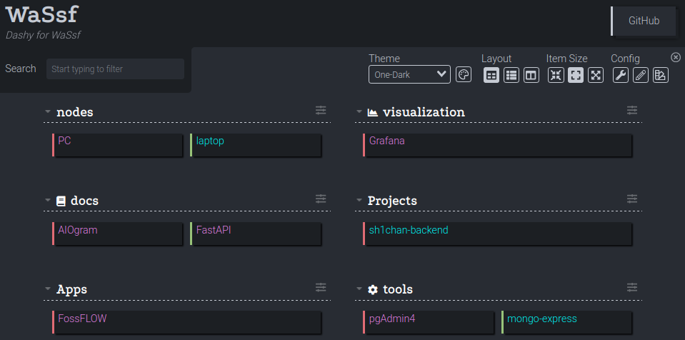

<p align="center">
	
</p>

```bash
docker-compose up -d --build
```

<table align=center>
  <tr>
    <th>Service</th>
    <th>Version</th>
    <th>Updated</th>
    <th>At</th>
  </tr>
  <tr>
    <td><a href="https://github.com/Lissy93/dashy">Dashy</a></td>
    <td>3.1.1</td>
    <td>:orange_heart:</td>
    <td>01.02.2025</td>
  </tr>
  <tr>
    <td><a href="https://github.com/grafana/grafana">Grafana</a></td>
    <td>3.1.1</td>
    <td>:orange_heart:</td>
    <td>02.02.2025</td>
  </tr>
  <tr>
    <td><a href="https://github.com/stan-smith/FossFLOW/">FossFLOW</a></td>
    <td>1.0.0</td>
    <td>:green_heart:</td>
    <td>04.07.2025</td>
  </tr>
  <tr>
    <td><a href="https://github.com/fastapi/fastapi">FastAPI</a></td>
    <td>0.115.12</td>
    <td>:orange_heart:</td>
    <td>01.02.2025</td>
  </tr>
  <tr>
    <td><a href="https://github.com/aiogram/aiogram">AIOgram</a></td>
    <td>3.20.0.post0</td>
    <td>:green_heart:</td>
    <td>25.05.2025</td>
  </tr>
  <tr>
    <td><a href="https://github.com/pgadmin-org/pgadmin4">pgAdmin4</a></td>
    <td>9.0</td>
    <td>:orange_heart:</td>
    <td>01.02.2025</td>
  </tr>
</table>
